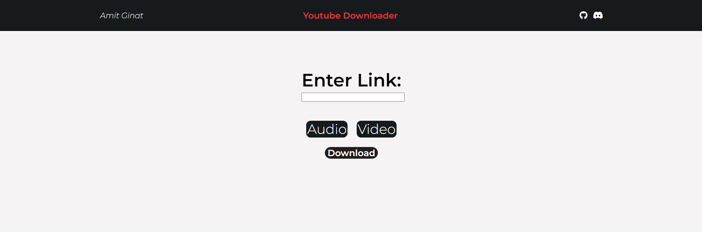

# Amit Ginat's YouTube Video Downloader

## Overview
Welcome to my YouTube Video Downloader! This simple web app was created as my first Flask project.

## Features
- Download YouTube videos as audio or video files.
- Using flask and pytube.

## How to Use
1. Simply paste the URL of the YouTube video you want to download.
2. Choose whether you'd like to download it as an audio or video file.
3. Hit the "Download" button.
4. Wait a moment, and your file will be ready to save.

## Preview

## Dependencies
This project relies on the following technologies:
- flask
- pytube
